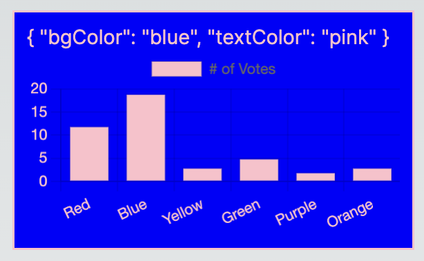

<h1 align="center">A simple UI library based on CSS Modules, featuring theming support</h1>
A boilerplate for a simple UI library featuring CSS Modules and theming support via either CSS Custom Properties or a JavaScript theme object.

## Installation

Install the package in your project directory with:

```bash
npm install @sashathor/css-modules-ui-lib-with-theming
```

## Create React App Demo

A simple demo of the library in a Create React App project.

### Getting Started

```bash
cd demos/cra
npm install
npm run start
```

### Custom Themes switching

```tsx
// App.tsx

import React from "react";
import {
  Button,
  Chart,
  ThemeProvider,
} from "@sashathor/css-modules-ui-lib-with-theming";

export const App = () => {
  const [theme, setTheme] = React.useState(themes.light);

  return (
    <>
      <ThemeProvider theme={theme}>
        <div style={{ marginBottom: 20 }}>
          <Button>Button</Button>
        </div>
        <Chart />
      </ThemeProvider>
      <button
        style={{ marginTop: 20 }}
        onClick={() =>
          setTheme(theme === themes.light ? themes.dark : themes.light)
        }
      >
        switch theme
      </button>
    </>
  );
};
```

<br /><br />

### Default Theme outside of `ThemeProvider`

```tsx
// App.tsx

import React from "react";
import { Button, Chart } from "@sashathor/css-modules-ui-lib-with-theming";

export const App = () => (
  <>
    <Button>Button</Button>
    <br />
    <br />
    <Chart />
  </>
);
```

<br /><br />

### Style override via `className` prop

```css
// theme.module.css

.customChart {
  background-color: red;
}
```

```tsx
// App.tsx

import React from "react";
import themeStyles from "./theme.module.css";
import { Chart } from "@sashathor/css-modules-ui-lib-with-theming";

export const App = () => (
  <>
    <Chart className={themes.customChart} />
  </>
);
```

<br /><br />

### Style override via `style` prop

```tsx
// App.tsx

import React from "react";
import { Chart } from "@sashathor/css-modules-ui-lib-with-theming";

export const App = () => (
  <>
    <Chart style={{ backgroundColor: "#00ff00" }} />
  </>
);
```

<br /><br />

### Style override via Emotion's `css` method

```tsx
// App.tsx

import React from "react";
import { css } from "@emotion/css";
import { Chart } from "@sashathor/css-modules-ui-lib-with-theming";

export const App = () => (
  <>
    <Chart
      className={css`
        background-color: orange;
      `}
    />
  </>
);
```

<br /><br />

## Next.js Demo

A simple demo of the library in a Next.js project.
Note: The library is compatible with Next.js Server Components out of the box.

### Getting Started

```bash
cd demos/nextjs
npm install
npm run dev
```

### Custom Theme

<br /><br />

### Default Theme

<br /><br />
